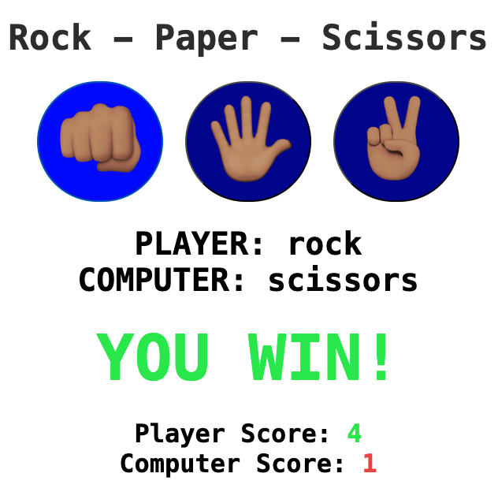

# Rock Paper Scissors Game

A fun and interactive Rock Paper Scissors game built with **HTML**, **CSS**, and **JavaScript**. Play against the computer with emoji buttons, real-time score tracking, and color-coded results.

## Features
- 🎮 Play against computer with random AI choices
- 👊 🖐 ✌️ Large emoji buttons for rock, paper, and scissors
- 🎯 Real-time result display with color-coded outcomes
- 📊 Persistent score tracking for player and computer
- 🎨 Clean, centered design with smooth hover effects
- 🔄 Unlimited rounds - play as long as you want

## Requirements
- Any modern web browser (Chrome, Firefox, Safari, Edge)
- No external dependencies or libraries needed

## Project structure
```
.
├── rps.html
├── rps.css
└── rps.js
```

## Screenshots


* The game interface features:
  - "Rock - Paper - Scissors" heading at the top (2.75rem, dark gray)
  - Three large circular emoji buttons (7rem font size):
    - 👊🏽 Rock
    - 🖐🏽 Paper
    - ✌🏽 Scissors
  - Player and computer choice displays (2.5rem)
  - Large result text (5rem) that changes color:
    - Green for "YOU WIN!"
    - Red for "YOU LOSE!"
    - Default for "IT'S A TIE!"
  - Score displays (2rem) with color-coded numbers:
    - Player score in green
    - Computer score in red
  - Blue button background (`hsl(240, 100%, 30%)`) with hover effect

## Usage
1. Open `rps.html` in your web browser
2. Click one of the three emoji buttons to make your choice:
   - 👊🏽 for Rock
   - 🖐🏽 for Paper
   - ✌🏽 for Scissors
3. The computer will automatically make a random choice
4. View the result and updated scores
5. Keep playing - scores persist throughout the session

## Game logic

### Win conditions:
- **Rock** beats **Scissors**
- **Paper** beats **Rock**
- **Scissors** beats **Paper**
- Same choices result in a **tie**

### Computer AI:
```javascript
const computerChoice = choices[Math.floor(Math.random() * 3)];
```
The computer randomly selects from rock, paper, or scissors using `Math.random()`.

### Result determination:
Uses a switch statement with ternary operators to determine the winner:
```javascript
switch(playerChoice) {
    case "rock":
        result = (computerChoice === "scissors") ? "YOU WIN!" : "YOU LOSE!";
        break;
    // ... similar logic for paper and scissors
}
```

## Functionality

### playGame(playerChoice)
Main function that handles game flow:
1. Generates random computer choice
2. Compares player vs computer choices
3. Determines result (win/lose/tie)
4. Updates displays with choices and result
5. Applies color coding (green for win, red for lose)
6. Updates and displays scores

### Score tracking:
- `playerScore` and `computerScore` variables persist across rounds
- Increments automatically on wins/losses
- Displayed in real-time after each round

### Dynamic styling:
- `classList.remove("greenText", "redText")` clears previous colors
- `classList.add()` applies appropriate color based on result
- Tie games display default color (no green/red)

## Customize
- **Emoji buttons**: Change the emoji in the HTML button elements
- **Button colors**: Modify `background-color: hsl(240, 100%, 30%);` in `.choices button`
- **Win/lose colors**: 
  - Win (green): `hsl(130, 84%, 54%)`
  - Lose (red): `hsl(0, 84%, 60%)`
- **Font sizes**:
  - Buttons: `font-size: 7rem;`
  - Result: `font-size: 5rem;`
  - Displays: `font-size: 2.5rem;`
  - Scores: `font-size: 2rem;`
- **Hover effect**: Change `background-color: hsl(240, 100%, 50%);` in `:hover`
- **Transition speed**: Modify `transition: background-color 0.5s ease;`

## Color scheme
- **Heading**: Dark gray (`hsl(0, 0%, 20%)`)
- **Buttons**: Blue (`hsl(240, 100%, 30%)`)
- **Button hover**: Lighter blue (`hsl(240, 100%, 50%)`)
- **Player score**: Green (`hsl(130, 84%, 54%)`)
- **Computer score**: Red (`hsl(0, 84%, 60%)`)
- **Win text**: Green (`.greenText`)
- **Lose text**: Red (`.redText`)

## Notes
- Scores persist throughout the session but reset on page refresh
- Uses monospace font with bold weight for consistent appearance
- All elements are vertically centered using flexbox
- Button spacing maintained with 10px horizontal margins
- Computer makes a new random choice for every round
- Result text automatically resets color class before each new game

## Possible enhancements
- Add a reset scores button
- Implement best-of-X rounds mode
- Add sound effects for wins/losses
- Store high scores in localStorage
- Add animation effects for choices

---

Happy gaming! 🎮